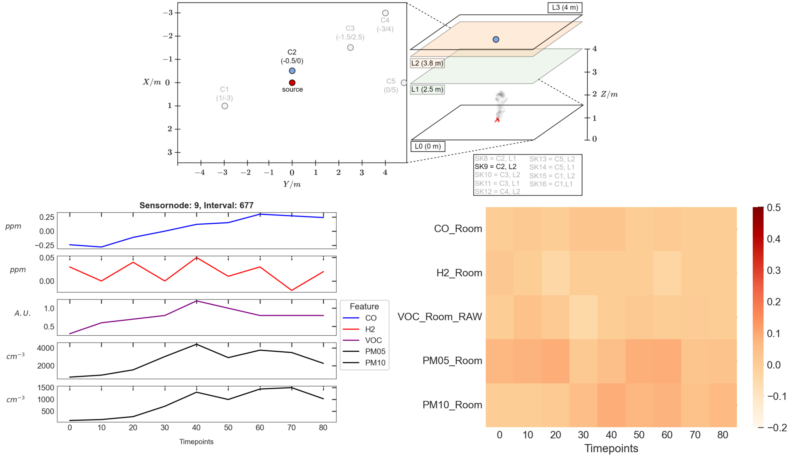

# D3-fire_detection_framework
 This repository contains the code used in the paper "Enhancing Early Indoor Fire Detection Using Indicative Patterns in Multivariate Time Series Data Based on Multi-Sensor Nodes".
 
We propose a tensor-based ”D3-Detection framework” to enhance early fire detection based on mutli sensor data. Our approach adds an explanation component to the prediction component, which provides valuable insights of fire indicative patterns recognized by the prediction component in the (a) dimension of emissions, (b) dimension of sensor placement and (c) dimension of time and enhances user understanding and effective parameter adaptation for real-world application. 


 
 Please cite our paper if you refer to our results or use the method or code in your own work:
 
```
@article{vorwerkEnhancingEarlyIndoor2025,
	title = {Enhancing early indoor fire detection using indicative patterns in multivariate time series data based on multi-sensor nodes},
	volume = {111},
	issn = {2352-7102},
	url = {https://www.sciencedirect.com/science/article/pii/S2352710225016547},
	doi = {10.1016/j.jobe.2025.113417},
	urldate = {2025-07-21},
	journal = {Journal of Building Engineering},
	author = {Vorwerk, Pascal and Wahba, Ismail and Spiliopoulou, Myra},
	month = oct,
	year = {2025},
}
```

 
 ## Abstract
 
 Multi-sensor technology is becoming increasingly accessible, resulting in more complex data structures that require reasonable analysis in order to extract crucial information. In this study, we propose a novel approach for enhancing early indoor fire detection using multi-sensor nodes. We model the task of early indoor fire detection as a binary classification problem in multivariate time series (MTS) data to capture early fire indicator patterns in their (a) dimension of emissions, (b) dimension of sensor placement and (c) dimension of time. We combine a prediction component based on ROCKET (RandOm Convolutional KErnel Transformation) and an explanation component based on SHAP (SHapley Additive exPlanations) as a novel approach to provide robust early fire detection and model agnostic explanations simultaneously in one system. Based on five different sensor measurements (CO, H2, VOC (volatile organic compounds), PM05, and PM10 (particulate matter)) mea-sured at nine different sensor node positions, our results highlight VOC and PM as the main early fire indicators, outperforming gases like H2 or CO. We demonstrate that the dimension of time is just as important to early indoor fire detection as the absolute sensor measurement value (dimension of emissions). Our findings indicate that a single node approach is more suitable than a network approach for the purpose of early indoor fire detec-tion. Furthermore, we could confirm the presence of numerical underflow in the KernalSHAP explanation for MTSC, which significantly reduces SHAP values (by up to 61 \%) at longer interval lengths. This effect also depends on the total number of input features.
 
 ## Setup
 
 Setup a python env based on python 3.12.3. The following package versions need to be installed in that env:
 
- shap 0.42.1
- sktime 0.33.0
- xgboost 1.7.3
- streamlit 1.24.1
 
 ## Usage and Reproducing Experiments
 
 To use this package, follow these steps:
 
 1) **Download the dataset**  
   Download the original dataset from Mendeley Data: **[DOI: 10.17632/npk2zcm85h.2](https://doi.org/10.17632/npk2zcm85h.2)**. Make sure to download **version 2** of the dataset, which is named `indoor_fire_detection_multisensornodes_dataset.csv`. 
 2) **Store the dataset in your local copy of this repo**
 - clone this repository to your local storage
 - store the dataset file named `indoor_fire_detection_multisensornodes_dataset.csv` into the following path: `...\D3-fire_detection_framework\model\data`
 3) **Run the three core model notebooks** 
 - Run [`data_preprocessing.ipynb`](model/data_preprocessing.ipynb) to remove ventilation artefacts, ensure correct data format for further processing as a multivariate time serie
 - Run the two model notebooks ([`detecting_early_fire_indicator_patterns_single_node.ipynb`](model/detecting_early_fire_indicator_patterns_single_node.ipynb) and [`detecting_early_fire_indicator_patterns_network.ipyn`](model/detecting_early_fire_indicator_patterns_network.ipyn)). They will automatically store the .csv files containing the predictions and explanations in the correct folder (`...\D3-fire_detection_framework\model\export\single_node` resp. `\network`). Note that you can define the options for scalers used in the pipeline in both scripts. The runtime of both scripts depends on the amount of defined scalers.
 4) **Run the explanation app to investiagte the model performance and time-related model explanations**
- Open a terminal running your python env (e.g. CMD prompt when using windows) and navigate to the model folder `...\D3-fire_detection_framework\model` using the command `cd ...\D3-fire_detection_framework\model`.
- Run [`explanation_module_app.py`](model/explanation_module_app.py) using the command `streamlit run explanation_module_app.py`. A new tab automatically opens in your default web browser displaying the explanation app.
 